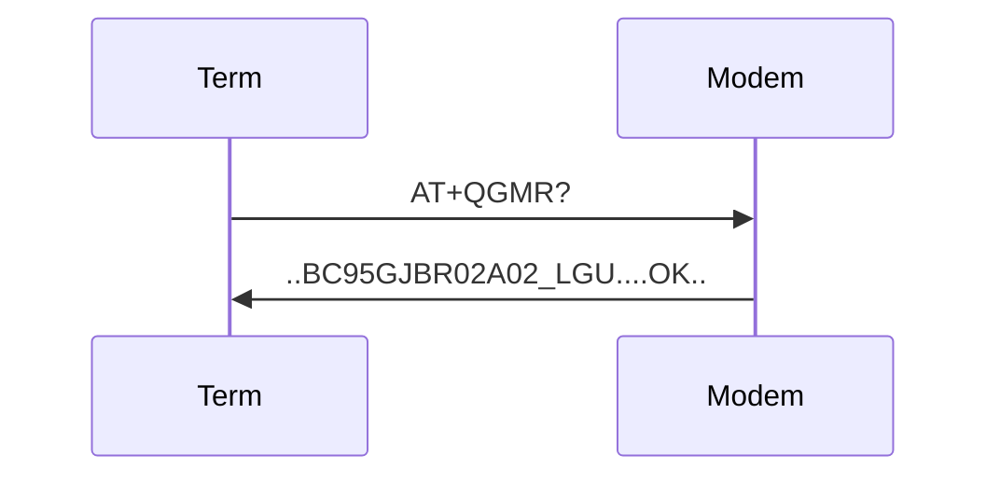
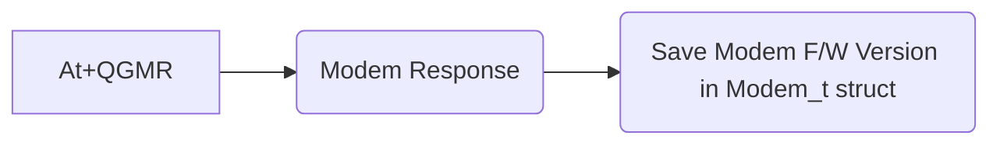

# HITEC 단말기

본 문서는 Firmware 품질 향상을 위한 TDD(Test Driven Development)의 일환으로 코드 변경사항 추적 문서화 기능을 담당한다.
단말의 기능 개발,변경 및 유지보수 등은 다음과 같은 순서로 작업한다.

1. 기능 변경, 설계사항 README 업데이트
2. Test Code 작성
3. 실제 Code 구현
4. Test Coverage 측정
5. 실제 단말 Test

# 목차

- [단말기 변경 이력](#단말기-변경-이력)
- [테스트코드 변경 이력](#테스트코드-변경-이력)

## Todo List

#### Main

- [ ] 유선 펌웨어 업그레이드 기능 확인
- [ ] 수자원 공사 보고주기 분할(최대 4일치) on/off 옵션 처리
  - 김영일 부장님 스마트폰 프로토콜 추가 필요
- [x] 일련 번호 시간 분산 테스트 이상없음
- [x] 보조중계기 P/F 버전 구현 / 테스트
- [x] AT+QLWULDATAEX 기능 추가, 테스트
- [ ] OTA, RCT 측정시 QREGSWT = 2 필요 (?)

#### Sub

- [ ] 강나루 대리 보조중계기 기능 Merge Test 필요
  - [ ] Push 버튼 동작 확인
  - [ ] Revision 1.9 LPM3 확인

# 단말기 변경 이력

### LGU+ 품질리포트 Ver 1.75 (2022-02-11)

LGU+의 요청사항 (신규 제품의 NW 품질리포트는 변경된 버전으로 반영 필요.)

- 변경사항
  - Msg Version 1 -> 4
  - FW 버전필드 (통신 모듈 버전 추가 필요)
  - UE INFO 필드 추가
  - PORT INFO 필드 추가
  - Reserve 필드 추가

| No        | 항목        | Byte  | 항목 설명                        | 표기 방법                         | 변경 여부      |
| --------- | ----------- | ----- | -------------------------------- | --------------------------------- | -------------- |
| 1         | MSG Ver     | 1     | 리포트 메시지 버전(4)            | BCD                               | 1 -> 4         |
| 전원      | Unit        | 1     | 단말 전원 종류 및 전압           | 고정값(00,01,02)                  |                |
|           | Level       | 2     | 단말 배터리 전압                 | BCD                               |                |
| GCI       | Serving CID | 4     | Serving Cell ID                  | HEX                               |                |
| RF        | RSRP        | 2     | References Signal 수신 레벨(dBm) | BCD                               |                |
|           | SINR        | 2     | 신호대간섭비(dB)                 | 1byte(부호)+BCD                   |                |
| 모델명    |             | 1~21  | 단말 기종 정보                   | 1byte(Len) + N byte(ASCII)        |                |
| FW버전    |             | 1~21  | 단말,모뎀 버전 정보              | 1byte(Len) + Device Ver/Modem Ver | 모뎀 버전 추가 |
| TX POWER  |             | 2     | 단말의 송신 파워 레벨            | 1byte(부호) + BCD                 |                |
| 위치정보  | 위도,경도   | 1or11 | 자사 단말 미지원 1byte           | 0                                 |                |
| Neighbor  | Cell ID     | 1~13  | 자사 단말 미지원 1byte           | 0                                 |                |
| UE INFO   |             | 1     | UE 사용 BAND 및 설치 타입 정보   | 비트 패턴으로 표기                | 신규 추가      |
| PORT INFO |             | 3     | 자사단말 미지원                  | 0x00 0x00 0x00                    | 신규 추가      |
| Reserved  |             | 3     | 관리 필요한 추가항목을 위해 예약 | Hex = F1F1F1                      | 신규 추가      |

#### AT+QGMR Response 추가

품질리포트 FW버전 모뎀 버전 추가로 인한 기능 추가

##### Terminal <-> Modem Sequence

##### Terminal Modem F/W Version Save Flow

### 강나루 대리 보조중계기 작업 Code Merge (2022-02-10)

변경된 기능사항

- 보조중계기 Push 버튼 기능 추가
- 보조중계기 Revision 1.9 전류테스트(LPM3) 버그 수정

### FOTA 기능 On, Test OK (2022-01-28)

2021년에 단말기의 심각한 불량이 많아 검증되지 않은 FOTA 기능을 다시 On. Test Ok

### regError, regRetry Flag 및 기능 제거(2022-01-26)

[U316 Version]에서 모뎀 psm상태시 P/F Register가 끊기는 경우가 발생하는데 모뎀이 연결이 유효한 것으로 착각하여 데이터 송신이 실패하던 현상이 발생했었는데 이를 해결하기 위해
ULDATA 실패여부를 체크하는 regError, regRety Flag가 생겼었다.

현재 U325버전에서는 그러한 부분이 발생하지 않도록 송신 후 P/F 접속을 끊어버리기 때문에 해당 코드들을 삭제한다.

### AT+QLWULDATAEX 기능 추가 (2022-01-25)

서울시 IS Tech 서버에서 과부하로 인해 특정 시간대(0~1시) 보고 단말기들에게 Ack를 못주는 현상 발생.
기존 단말의 기능에서 Ack를 받지 못하면 검침데이터가 쌓이게 되고 수자원 공사의 요구사항인 검침 데이터 4일치 보관이 겹쳐 Issue 발생.

AT+QLWULDATAEX는 데이터 Uplink시 LG Platform에 전송이 됐는지 확인이 가능. Platform Uplink가 확인되면 검침데이터를 삭제하도록 기능 변경.

### 강나루 대리 변경사항 Merge (2022-01-24)

Bsl Update 기능 오류 수정

# 테스트코드 변경 이력

### MODEM_qaData 추가 (2022-02-11)

LGU+ 품질리포트 Msg 생성 함수

### parseQGMR 추가 (2022-02-11)

모뎀 F/W Version Read 함수

### METER_addStoredData 추가 (2022-02-09)

검침데이터 저장 처리 알고리즘

- 수정사항
  - RTC_calcSecDiff()에서 struct tm(local variable) 초기화 추가항목
    - local variable 미초기화로 잘못된 result 나오는 Case 발견
  - METER_addStoredData() Refactoring

### Gcov(Test Code Coverage Tool) 추가 (2022-02-08)

테스트 결과 html파일로 생성

### distributingReportTime 추가 (2022-02-07)

보고시간 분산 알고리즘 함수

- FLASH_readConfigInfo() 함수에 통합되어 있던 코드 분할 -> distributingReportTime()

### checkInterval 추가 (2022-01-28)

단말기의 보고시간 여부 Check 함수

### Ceedling 추가 (2022-01-25)

펌웨어 품질 향상을 위해 단위 유닛 테스트 기능 추가

- Ceedling 단위 유닛 테스트 Tool 기능 추가
- parseCEREG 테스트 추가
