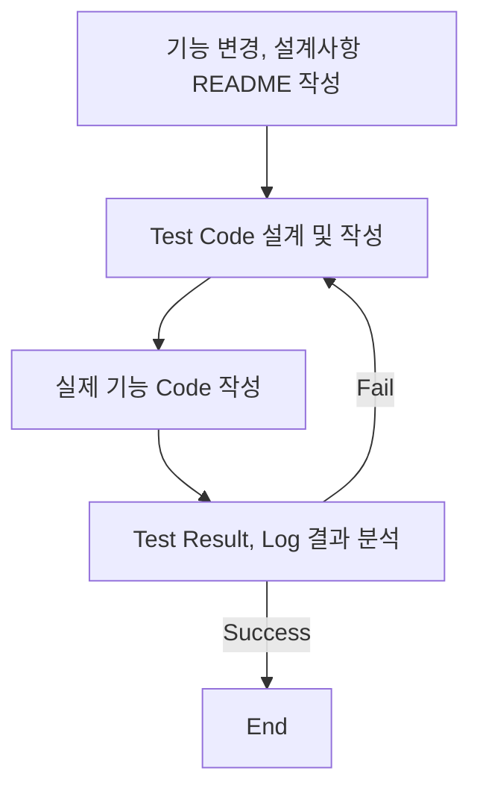
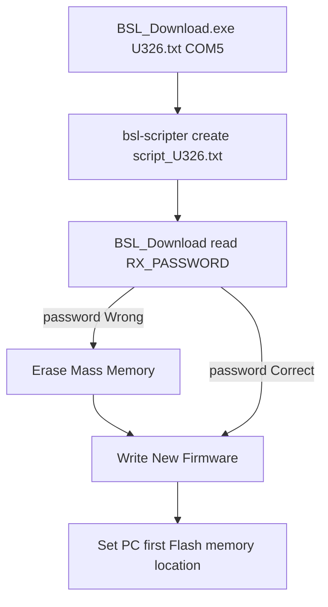
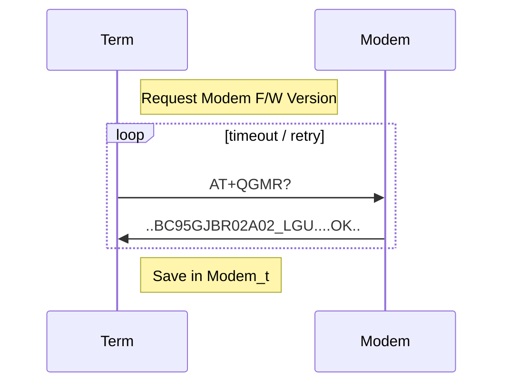
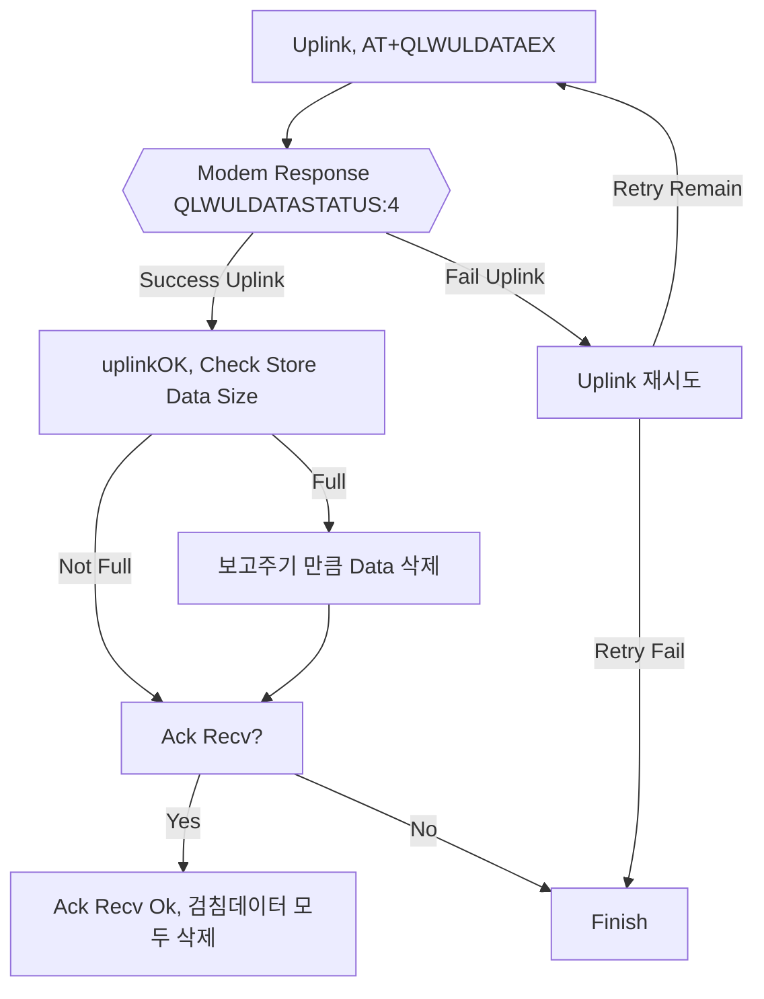

# 목차

<!-- TOC start -->

- [Intro](#Intro)
- [문서](#문서)
- [단말기 변경 이력](#단말기-변경-이력)
  - [U701](#u701)

<!-- TOC end -->

# Intro

본 문서는 Firmware 품질 향상을 위한 TDD(Test Driven Development)의 일환으로 코드 변경사항 추적 문서화 기능을 담당한다.
단말의 기능 개발,변경 및 유지보수 등은 다음과 같은 순서로 작업한다.



## Todo List

#### Main

- [x] Flash Read시 쓰레기 데이터가 들어오는지 확인, 초기화하는 기능 추가 필요

- [x] 최종버전(U325) 현장 불량 검토 --> 신규 불량이 존재하는지?

  - [x] NFC 불량
  - [x] Flash 불량
  - [x] 통신 불량

- [x] 유선 펌웨어 업그레이드 기능 확인

  - [x] NB-IoT (UDP, P/F)
  - [x] LoRa SKT

- [x] AT+QLWULDATAEX 기능 추가, 테스트
- [x] 수자원 공사 보고주기 분할(최대 4일치) on/off 옵션 처리
  - 김영일 부장님 스마트폰 프로토콜 추가 필요
- [x] 일련 번호 시간 분산 테스트 이상없음
- [x] 보조중계기 P/F 버전 구현 / 테스트
  - [x] 강나루 대리 보조중계기 기능 Merge

#### Sub

- [x] 체크리스트 테스트[김용태 대리 작성]

# 문서

- [단말기 체크리스트](docs/테스트_체크리스트.xlsx) path:docs/테스트\_체크리스트

# 단말기 변경 이력

## NB-IoT

### NB-IoT P/F 개선

#### NB-IoT 통신 절차 개선 (2022-03-16)

##### Timeout / Retry 변경

| Step                    | Timeout(기존->변경) | Retry(기존->변경) |
| ----------------------- | ------------------- | ----------------- |
| Attach                  | X(120sec)           | 1->2              |
| P/F Bootstrap, Register | X(90sec)            | 1->2              |
| Uplink Data             | 10sec -> 30sec      | 0->2              |
| Check Time              | 120sec-> 60sec      | X                 |
| Bip                     | 300sec -> 50sec     | X                 |

> 기존 Uplink는 OK Response만 받았으나 이제 Uplink 전송여부를 받으므로 시간 증가.

> Bip 원격개통을 하지 않으므로 시간 감소

##### 절차 변경

- P/F Register시 Fail이 자주 발생. Uplink 후 Deregister를 하도록 변경.
- 마지막 Retry는 Modem 종료후 2분뒤 시도하도록 변경

#### 최적화 기능 lv2 ON (2022-03-16)

delay 함수들 변수 volatile type 변경 (최적화 방지)

#### Interrupt Service Routine 에서 Interrupt Enable bit 조작시 MCU hang (2022-03-16)

NFC Service Routine 제외 bit 조작처리 삭제.
발생하더라도 WDTHOLD를 하지 않게 수정 했으므로 1시간 뒤 복구.

#### MSP430F5419A Errata(FLASH35) 적용. (2022-03-15)

특정 상황에서 Flash Read Error 발생하는 칩 버그

##### 발생 상황 시나리오

펌웨어에서 해당되는 사항들만 기록.  
해당 사항들은 MCU hang, Flash 깨짐 불량의 원인중 하나로 보임

###### Affected Devices

- MSP430F5419AIPZ
- MSP430F5419AIPZR
- MSP430F5419AIZQW
- MSP430F5419AIZQWR
- MSP430F5419AIZQWT

###### Affected Memory Location

- bank 0/2
- Info A/C
- BSL 0/2

###### Affected Flash Idle Time

Flash Access한 시간이 아래 상황의 Idle Time보다 길면 첫번째 Flash Access에서 발생 가능

> Flash Access Time은 Bank 각각으로 적용됨.
> example) Flash A Bank실행 200ms후 B Bank로 넘어가면 발생가능

| 온도[°C] | Idle Time Typical [ms] |
| -------- | ---------------------- |
| 30       | 15                     |
| 50       | 2                      |
| 85       | 0.5                    |

###### LPM Use

LPM 사용 후 실행된 ISR_VECTOR가 Flash Read Error로 잘못된 주소로 실행될 수 있음.

###### Flash Segment Erase

Flash Segment Erase시 기본적으로 23ms~32ms가 소모됨.  
Flash Idle Time을 넘으므로 Flash Read Error 발생 가능함

###### BSL Entry and Exit

BSL 진입, 퇴장시 발생 가능

##### Application Robustness

TI에서 제안한 방법은 아래에 적용하지만 불가능한 부분들이 존재.
불가능한 부분은 잘못된 code memory 접근시 무한루프 빠짐,  
따라서 WDT Time 16s->1h 8min으로 변경 & WDTHOLD를 하지 않는것으로 대처

- 대처 방안
  - [x] Vcore Level low
  - [x] ISR memory location above 0x8000
  - [x] Flash Erase시 asm코드(asm(" bis.w #0,R3 ");) 추가

##### See Detail Errata Sheet

[MSP430F5419A Microcontroller Errata (Rev. AC)](https://www.ti.com/lit/er/slaz282ac/slaz282ac.pdf?ts=1647223226855&ref_url=https%253A%252F%252Fwww.ti.com%252Fdocument-viewer%252FMSP430F5419A%252Fdatasheet%252FGUID-82181F47-3DE4-4ED4-9826-67BF00DB88C6)

[Flash Read Error and Susceptibility for MSP430F54xxA](https://www.ti.com/lit/an/slaa470/slaa470.pdf?ts=1647398329345&ref_url=https%253A%252F%252Fwww.google.com%252F)

#### Flash 불량(깨짐) 개선 (2022-03-14)

Flash Memory가 깨져 Server IP,Port, 서비스코드등이 부정확해져 통신실패가 발생하는 불량 개선.

- config_t, 설정 전역변수(RAM) NO_INIT Pragma
- FLASH Write Fail시 Reboot (x)
- FLASH Read Fail시 Server IP,Port,S/N, IMEI등의 정보는 초기화 하지 않음.
  - FLASH Read Ok시 이전과 동일하게 설정 전역변수 모두 Flash Data로 덮어씀.

#### malloc() 실패시 Reboot 추가 (2022-03-11)

일부 malloc()실패해도 Reboot되지 않는 부분 수정.

#### Flash Code Refactoring (2022-03-11)

- Flash Write 실패시 Reboot 삭제.
- Flash Busy시 printf 추가

#### NB bip() Timeout / Retry 변경 (2022-03-11)

- 20초/15회 -> 5초/10회

#### 사용하지 않는 코드 삭제 (2022-03-11)

- app.c
  - APP_runPeriodicCheckNFC()
- MSP430FlashUtil.c
  - initFlash()
  - doneFlash()
- NFC_i2c.c
  - NFC_checkTagSetting()
- flashDriver.c
  - FLASH_readResetCause()

### BSL 기능 수정, 테스트 (2022-03-02)

펌웨어 쓰기는 정상 작동했으나 Set PC가 main()으로 jump하지 않아 자동으로 재실행되지 않는 문제 수정.  
Set PC는 bsl-scripter가 자동으로 FLASH 메모리의 첫번째 주소로 생성하는것으로 보이므로 main()함수를 FLASH 첫번째에 위치하도록 함.

- 수정사항

```c
file main.c

// main 메모리 section 생성.
#pragma CODE_SECTION(main, "MAIN")
main(){
...
}
```

```
file lnk_msp430f5419a.cmd

// MAIN 메모리 section을 FLASH 첫번째 주소에 강제 지정.
FLASHA : origin = 0x5C00, length = 0x0100
```

#### BSL 파일구조

| 파일명                             | 기능                             | Detail                                    |
| ---------------------------------- | -------------------------------- | ----------------------------------------- |
| bsl-scripter-windows.exe           | bsl script 생성 파일             | ti-txt 파일을 읽어 script 파일을 생성한다 |
| BSL_Download.exe                   | bsl script load & run            | script 파일을 읽어 bsl 과정을 진행        |
| \*.txt 예) U326.txt                | ti-txt 형식의 binary             | msp430에서 실행될 binary 파일             |
| script\_\*.txt 예) script_U326.txt | BSL_Download.exe가 실행할 script | bsl-scripter에 의해 매번 자동 생성된다    |



### IAR to CCS 변경 (2022-02-24)

NB Platform 단말, 보조중계기 프로젝트 생성

- [x] Test ok

#### 변경 사유

- Jtag Debug 기능 사용
- CCS는 무료버전으로 최신 업데이트 배포

#### 변경 사항

- IAR 종속적인 코드 변경
  - #pragma inline  
    → pragma func()
  - #pragma optimize = none  
    → 어차피 optimize 기능 끔
  - dataFlash.c 기능으로 변경된 linker정보변경 적용
    → FLASHC = length(0x5000) → 0x2330 으로 변경
  - RTCASMFunctions_IAR.s43파일 제거  
    → RTC read, set 모두 asm → c언어로 변경
  - md5, uuid 파일 library  
    → source file 변경

## U701 Release (2022-02-18)

### 변경 이력

<!-- TOC start -->

#### 기능 변경

- [dataSkipMode 추가 (2022-02-16)](#dataskipmode-2022-02-16)
- [LGU+ 품질리포트 Ver 1.75 (2022-02-11)](#lgu-ver-175-2022-02-11)
  - [AT+QGMR Response 추가](#atqgmr-response-)
    - [Terminal <-> Modem Sequence Diagram](#terminal-modem-sequence-diagram)
- [강나루 대리 보조중계기 작업 Code Merge (2022-02-10)](#-code-merge-2022-02-10)
- [FOTA 기능 On, Test OK (2022-01-28)](#fota-on-test-ok-2022-01-28)
- [regError, regRetry Flag 및 기능 제거(2022-01-26)](#regerror-regretry-flag-2022-01-26)
- [AT+QLWULDATAEX 기능 추가 (2022-01-25)](#atqlwuldataex-2022-01-25)
  - [FlowChart](#flowchart)
- [강나루 대리 변경사항 Merge (2022-01-24)](#-merge-2022-01-24)

<!-- TOC end -->

#### Bug Fix

단말의 기능에 지장은 주지 않을것으로 보이는 논리적 에러 수정  
상세한 내용은 test 폴더의 README 참조

- RTC_calcSecDiff()에서 struct tm(local variable) 초기화 추가항목
  - local variable 미초기화로 잘못된 result 나오는 Case 수정
- METER_addStoredData() Refactoring
  - nData == Max일때 검침데이터 일부 메모리 삭제 안되는 부분 수정 (2022-02-16)

<!-- TOC --><a name="dataskipmode-2022-02-16"></a>

### 강나루 대리 작업 버전 Merge & Test (2022-02-17)

- 변경사항
  - 보조 중계기 Push 버튼(즉시 검침)
  - lpm3 검사시 Push Port Setting 변경으로 과전류(40uA), 해당 부분 수정

### dataSkipMode 추가 (2022-02-16)

수자원 공사의 요청사항으로 검침데이터가 Max(24개)에서 지속적인 통신 실패시 검침데이터를 분할하여  
최대 4일치의 데이터를 저장하는 기능과 서울시 프로토콜상 검침데이터를 1개씩 삭제하도록 되어있는 것이 충돌.  
NFC 설정을 할수 있도록 옵션화.

> NB-IoT 단말만 추가, Default Value 4Days

<!-- TOC --><a name="lgu-ver-175-2022-02-11"></a>

### LGU+ 품질리포트 Ver 1.75 (2022-02-11)

LGU+의 요청사항 (신규 제품의 NW 품질리포트는 변경된 버전으로 반영 필요.)

- 변경사항
  - [x] Msg Struct 변경
    - [x] Msg Version 1 -> 4
    - [x] FW 버전필드 (통신 모듈 버전 추가 필요)
      - [x] Length 20byte 변경
      - [x] Modem Firmware Version Add
    - [x] UE INFO 필드 추가
    - [x] PORT INFO 필드 추가, 0x000000
    - [x] Reserve 필드 추가, 0xF1F1F1

`malloc 사용을 회피하기 위해 20Byte 고정으로 함. format [len, Device Version/Modem Version(20byte)] 보다 길면 20byte 고정 크기만큼 입력. Modem Version String이 14보다 작더라도 msg size는 20이므로 공백 문자가 채워짐`

| No        | 항목        | Byte  | 항목 설명                        | 표기 방법                         | 변경 여부      |
| --------- | ----------- | ----- | -------------------------------- | --------------------------------- | -------------- |
| 1         | MSG Ver     | 1     | 리포트 메시지 버전(4)            | BCD                               | 1 -> 4         |
| 전원      | Unit        | 1     | 단말 전원 종류 및 전압           | 고정값(00,01,02)                  |                |
|           | Level       | 2     | 단말 배터리 전압                 | BCD                               |                |
| GCI       | Serving CID | 4     | Serving Cell ID                  | HEX                               |                |
| RF        | RSRP        | 2     | References Signal 수신 레벨(dBm) | BCD                               |                |
|           | SINR        | 2     | 신호대간섭비(dB)                 | 1byte(부호)+BCD                   |                |
| 모델명    |             | 1~21  | 단말 기종 정보                   | 1byte(Len) + N byte(ASCII)        |                |
| FW버전    |             | 1~21  | 단말,모뎀 버전 정보              | 1byte(Len) + Device Ver/Modem Ver | 모뎀 버전 추가 |
| TX POWER  |             | 2     | 단말의 송신 파워 레벨            | 1byte(부호) + BCD                 |                |
| 위치정보  | 위도,경도   | 1or11 | 자사 단말 미지원 1byte           | 0                                 |                |
| Neighbor  | Cell ID     | 1~13  | 자사 단말 미지원 1byte           | 0                                 |                |
| UE INFO   |             | 1     | UE 사용 BAND 및 설치 타입 정보   | 비트 패턴으로 표기                | 신규 추가      |
| PORT INFO |             | 3     | 자사단말 미지원                  | 0x00 0x00 0x00                    | 신규 추가      |
| Reserved  |             | 3     | 관리 필요한 추가항목을 위해 예약 | Hex = F1F1F1                      | 신규 추가      |

<!-- TOC --><a name="atqgmr-response-"></a>

#### AT+QGMR Response 추가

품질리포트 FW버전 모뎀 버전 추가로 인한 기능 추가

<!-- TOC --><a name="terminal-modem-sequence-diagram"></a>

##### Terminal <-> Modem Sequence Diagram



<!-- TOC --><a name="-code-merge-2022-02-10"></a>

### 강나루 대리 보조중계기 작업 Code Merge (2022-02-10)

변경된 기능사항

- 보조중계기 Push 버튼 기능 추가
- 보조중계기 Revision 1.9 전류테스트(LPM3) 버그 수정

<!-- TOC --><a name="fota-on-test-ok-2022-01-28"></a>

### FOTA 기능 On, Test OK (2022-01-28)

2021년에 단말기의 심각한 불량이 많아 검증되지 않은 FOTA 기능을 다시 On. Test Ok

<!-- TOC --><a name="regerror-regretry-flag-2022-01-26"></a>

### regError, regRetry Flag 및 기능 제거(2022-01-26)

[U316 Version]에서 모뎀 psm상태시 P/F Register가 끊기는 경우가 발생하는데 모뎀이 연결이 유효한 것으로 착각하여 데이터 송신이 실패하던 현상이 발생했었는데 이를 해결하기 위해
ULDATA 실패여부를 체크하는 regError, regRety Flag를 추가하고 Uplink 실패시 재시도를 하는 기능 추가.

현재 U325버전에서는 그러한 부분이 발생하지 않도록 송신 후 P/F 접속을 끊어버리기 때문에 해당 코드들을 삭제한다.

<!-- TOC --><a name="atqlwuldataex-2022-01-25"></a>

### AT+QLWULDATAEX 기능 추가 (2022-01-25)

서울시 IS Tech 서버에서 과부하로 인해 특정 시간대(0~1시) 보고 단말기들에게 Ack를 못주는 현상 발생.
기존 단말의 기능에서 Ack를 받지 못하면 검침데이터가 쌓이게 되고 수자원 공사의 요구사항인 검침 데이터 4일치 보관이 겹쳐 Issue 발생.

AT+QLWULDATAEX는 데이터 Uplink시 LG Platform에 전송이 됐는지 확인이 가능. Platform Uplink가 확인되면 검침데이터를 삭제하도록 기능 변경.

<!-- TOC --><a name="flowchart"></a>

#### FlowChart



QLWULDATASTATUS:[Status] Status가 4가 아니라면 Uplink실패이므로 재시도

> #define HAVE_NOT_BEEN_SENT 0  
> #define WAIT_RESPONSE_PLATFORM 1  
> #define SENT_FAILED 2  
> #define TIMEOUT 3  
> #define SEND_SUCCESS 4  
> #define GOT_RESET_MSG 5

<!-- TOC --><a name="-merge-2022-01-24"></a>

### 강나루 대리 변경사항 Merge (2022-01-24)

Bsl Update 기능 오류 수정

## LoRa

### LoRa SKT F/W 유선 업그레이드 Test (2022-03-03)

- [x] Test Ok

#### dataSkipMode LoRa 구조체에도 추가

### LoRa SKT Project 생성 (2022-03-03)
