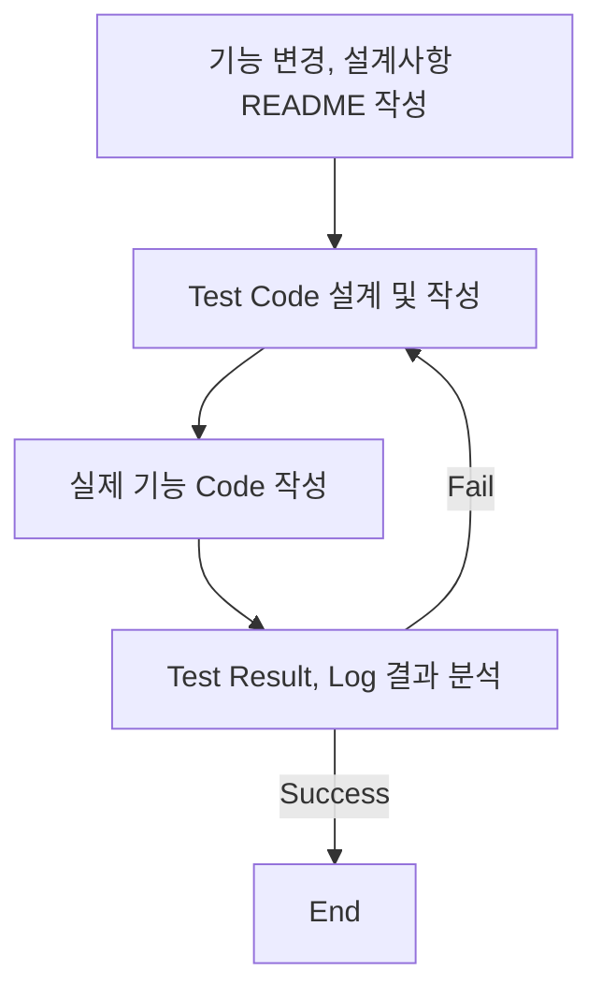
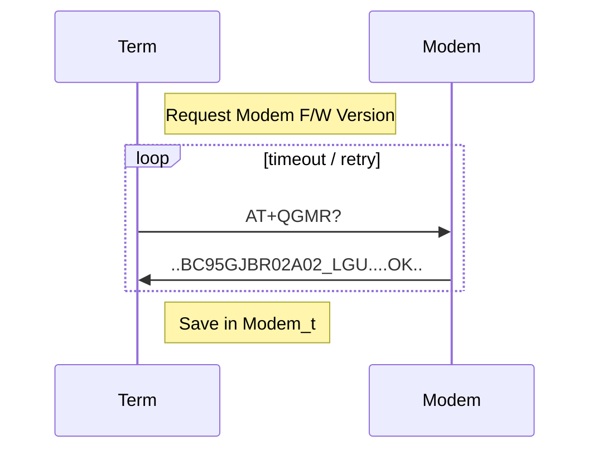
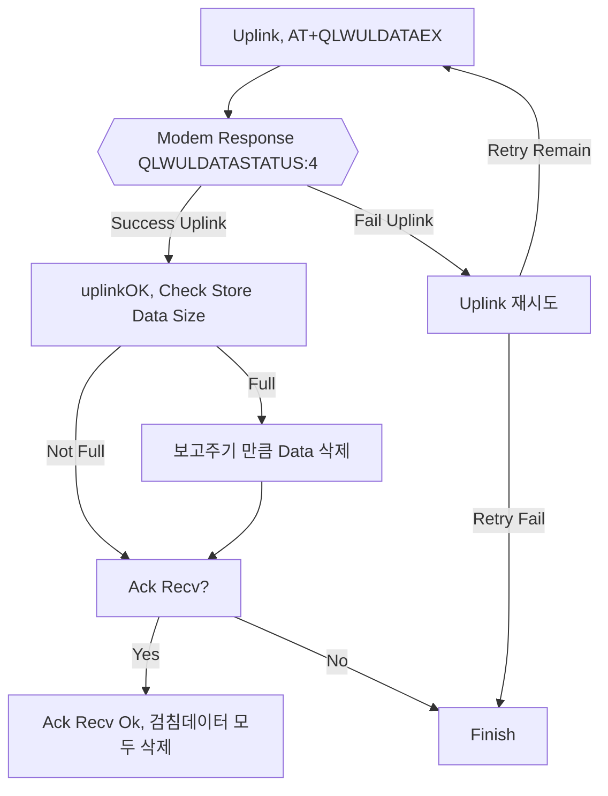

# 목차

<!-- TOC start -->

- [Intro](#Intro)
- [문서](#문서)
- [단말기 변경 이력](#단말기-변경-이력)
  - [U701](#u701)

<!-- TOC end -->

# Intro

본 문서는 Firmware 품질 향상을 위한 TDD(Test Driven Development)의 일환으로 코드 변경사항 추적 문서화 기능을 담당한다.
단말의 기능 개발,변경 및 유지보수 등은 다음과 같은 순서로 작업한다.

## Todo List

#### Main

- [ ] Flash Read시 쓰레기 데이터가 들어오는지 확인, 초기화하는 기능 추가 필요
- [ ] 유선 펌웨어 업그레이드 기능 확인
- [ ] OTA, RCT 측정시 QREGSWT = 2 필요 (?)

- [x] AT+QLWULDATAEX 기능 추가, 테스트
- [x] 수자원 공사 보고주기 분할(최대 4일치) on/off 옵션 처리
  - 김영일 부장님 스마트폰 프로토콜 추가 필요
- [x] 일련 번호 시간 분산 테스트 이상없음
- [x] 보조중계기 P/F 버전 구현 / 테스트
  - [x] 강나루 대리 보조중계기 기능 Merge

#### Sub

- [x] 체크리스트 테스트[김용태 대리 작성]

# 문서

- [단말기 체크리스트](docs/테스트_체크리스트.xlsx) path:docs/테스트\_체크리스트

# 단말기 변경 이력

### IAR to CCS 변경 (2022-02-24)

#### 변경 사유

- Jtag Debug 기능 사용
- CCS는 무료버전으로 최신 업데이트 배포

#### 변경 사항

- IAR 종속적인 코드 변경
  - #pragma inline  
    → pragma func()
  - #pragma optimize = none  
    → 어차피 optimize 기능 끔
  - dataFlash.c 기능으로 변경된 linker정보 파일  
    → 변경이 필요없을듯 보이지만 정보를 위해 lnk.cmd FLASHC = length(0x5000) → 0x5C00 으로 변경
  - RTCASMFunctions_IAR.s43파일 제거  
    → RTC read, set 모두 asm → c언어로 변경
  - md5, uuid 파일 library  
    → source file 변경

## U701 Release (2022-02-18)

### 변경 이력

<!-- TOC start -->

#### 기능 변경

- [dataSkipMode 추가 (2022-02-16)](#dataskipmode-2022-02-16)
- [LGU+ 품질리포트 Ver 1.75 (2022-02-11)](#lgu-ver-175-2022-02-11)
  - [AT+QGMR Response 추가](#atqgmr-response-)
    - [Terminal <-> Modem Sequence Diagram](#terminal-modem-sequence-diagram)
- [강나루 대리 보조중계기 작업 Code Merge (2022-02-10)](#-code-merge-2022-02-10)
- [FOTA 기능 On, Test OK (2022-01-28)](#fota-on-test-ok-2022-01-28)
- [regError, regRetry Flag 및 기능 제거(2022-01-26)](#regerror-regretry-flag-2022-01-26)
- [AT+QLWULDATAEX 기능 추가 (2022-01-25)](#atqlwuldataex-2022-01-25)
  - [FlowChart](#flowchart)
- [강나루 대리 변경사항 Merge (2022-01-24)](#-merge-2022-01-24)

<!-- TOC end -->

#### Bug Fix

단말의 기능에 지장은 주지 않을것으로 보이는 논리적 에러 수정  
상세한 내용은 test 폴더의 README 참조

- RTC_calcSecDiff()에서 struct tm(local variable) 초기화 추가항목
  - local variable 미초기화로 잘못된 result 나오는 Case 수정
- METER_addStoredData() Refactoring
  - nData == Max일때 검침데이터 일부 메모리 삭제 안되는 부분 수정 (2022-02-16)

<!-- TOC -->

### 강나루 대리 작업 버전 Merge & Test (2022-02-17)

- 변경사항
  - 보조 중계기 Push 버튼(즉시 검침)
  - lpm3 검사시 Push Port Setting 변경으로 과전류(40uA), 해당 부분 수정

### dataSkipMode 추가 (2022-02-16)

수자원 공사의 요청사항으로 검침데이터가 Max(24개)에서 지속적인 통신 실패시 검침데이터를 분할하여  
최대 4일치의 데이터를 저장하는 기능과 서울시 프로토콜상 검침데이터를 1개씩 삭제하도록 되어있는 것이 충돌.  
NFC 설정을 할수 있도록 옵션화.

> NB-IoT 단말만 추가, Default Value 4Days

<!-- TOC -->

### LGU+ 품질리포트 Ver 1.75 (2022-02-11)

LGU+의 요청사항 (신규 제품의 NW 품질리포트는 변경된 버전으로 반영 필요.)

- 변경사항
  - [x] Msg Struct 변경
    - [x] Msg Version 1 -> 4
    - [x] FW 버전필드 (통신 모듈 버전 추가 필요)
      - [x] Length 20byte 변경
      - [x] Modem Firmware Version Add
    - [x] UE INFO 필드 추가
    - [x] PORT INFO 필드 추가, 0x000000
    - [x] Reserve 필드 추가, 0xF1F1F1

`malloc 사용을 회피하기 위해 20Byte 고정으로 함. format [len, Device Version/Modem Version(20byte)] 보다 길면 20byte 고정 크기만큼 입력. Modem Version String이 14보다 작더라도 msg size는 20이므로 공백 문자가 채워짐`

| No        | 항목        | Byte  | 항목 설명                        | 표기 방법                         | 변경 여부      |
| --------- | ----------- | ----- | -------------------------------- | --------------------------------- | -------------- |
| 1         | MSG Ver     | 1     | 리포트 메시지 버전(4)            | BCD                               | 1 -> 4         |
| 전원      | Unit        | 1     | 단말 전원 종류 및 전압           | 고정값(00,01,02)                  |                |
|           | Level       | 2     | 단말 배터리 전압                 | BCD                               |                |
| GCI       | Serving CID | 4     | Serving Cell ID                  | HEX                               |                |
| RF        | RSRP        | 2     | References Signal 수신 레벨(dBm) | BCD                               |                |
|           | SINR        | 2     | 신호대간섭비(dB)                 | 1byte(부호)+BCD                   |                |
| 모델명    |             | 1~21  | 단말 기종 정보                   | 1byte(Len) + N byte(ASCII)        |                |
| FW버전    |             | 1~21  | 단말,모뎀 버전 정보              | 1byte(Len) + Device Ver/Modem Ver | 모뎀 버전 추가 |
| TX POWER  |             | 2     | 단말의 송신 파워 레벨            | 1byte(부호) + BCD                 |                |
| 위치정보  | 위도,경도   | 1or11 | 자사 단말 미지원 1byte           | 0                                 |                |
| Neighbor  | Cell ID     | 1~13  | 자사 단말 미지원 1byte           | 0                                 |                |
| UE INFO   |             | 1     | UE 사용 BAND 및 설치 타입 정보   | 비트 패턴으로 표기                | 신규 추가      |
| PORT INFO |             | 3     | 자사단말 미지원                  | 0x00 0x00 0x00                    | 신규 추가      |
| Reserved  |             | 3     | 관리 필요한 추가항목을 위해 예약 | Hex = F1F1F1                      | 신규 추가      |

<!-- TOC -->

#### AT+QGMR Response 추가

품질리포트 FW버전 모뎀 버전 추가로 인한 기능 추가

<!-- TOC -->

##### Terminal <-> Modem Sequence Diagram

<!-- TOC -->

### 강나루 대리 보조중계기 작업 Code Merge (2022-02-10)

변경된 기능사항

- 보조중계기 Push 버튼 기능 추가
- 보조중계기 Revision 1.9 전류테스트(LPM3) 버그 수정

<!-- TOC -->

### FOTA 기능 On, Test OK (2022-01-28)

2021년에 단말기의 심각한 불량이 많아 검증되지 않은 FOTA 기능을 다시 On. Test Ok

<!-- TOC -->

### regError, regRetry Flag 및 기능 제거(2022-01-26)

[U316 Version]에서 모뎀 psm상태시 P/F Register가 끊기는 경우가 발생하는데 모뎀이 연결이 유효한 것으로 착각하여 데이터 송신이 실패하던 현상이 발생했었는데 이를 해결하기 위해
ULDATA 실패여부를 체크하는 regError, regRety Flag를 추가하고 Uplink 실패시 재시도를 하는 기능 추가.

현재 U325버전에서는 그러한 부분이 발생하지 않도록 송신 후 P/F 접속을 끊어버리기 때문에 해당 코드들을 삭제한다.

<!-- TOC -->

### AT+QLWULDATAEX 기능 추가 (2022-01-25)

서울시 IS Tech 서버에서 과부하로 인해 특정 시간대(0~1시) 보고 단말기들에게 Ack를 못주는 현상 발생.
기존 단말의 기능에서 Ack를 받지 못하면 검침데이터가 쌓이게 되고 수자원 공사의 요구사항인 검침 데이터 4일치 보관이 겹쳐 Issue 발생.

AT+QLWULDATAEX는 데이터 Uplink시 LG Platform에 전송이 됐는지 확인이 가능. Platform Uplink가 확인되면 검침데이터를 삭제하도록 기능 변경.

<!-- TOC -->

#### FlowChart

QLWULDATASTATUS:[Status] Status가 4가 아니라면 Uplink실패이므로 재시도

> #define HAVE_NOT_BEEN_SENT 0  
> #define WAIT_RESPONSE_PLATFORM 1  
> #define SENT_FAILED 2  
> #define TIMEOUT 3  
> #define SEND_SUCCESS 4  
> #define GOT_RESET_MSG 5

<!-- TOC -->

### 강나루 대리 변경사항 Merge (2022-01-24)

Bsl Update 기능 오류 수정
